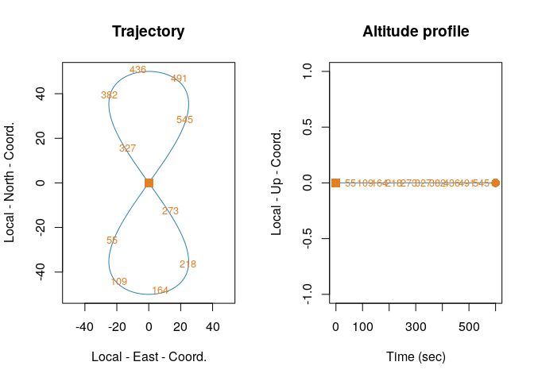
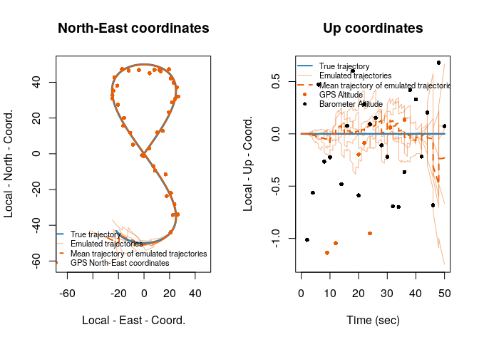
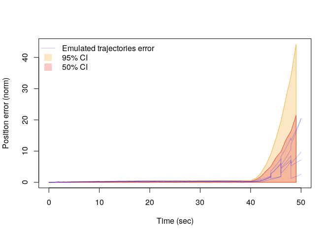

<div class="bg-blue-light mb-2">
  .text-gray-dark on .bg-blue-light
</div>

<!-- README.md is generated from README.Rmd. Please edit that file -->

[](https://opensource.org/licenses/AGPL-3.0)
[](https://cran.r-project.org/)
[](https://github.com/SMAC-Group/simts)

# `navigation2` Overview <a href="https://smac-group.com/"></a>

The `navigation2` R package was initiated to allow for analyzing the
impact of sensor error modeling on performance of integrated navigation
(sensor fusion) based on IMU, GPS (generally speaking, GNSS), and
barometer data. The package allows for one of the two major tasks:

  - **Sensor model evaluation:** The user shall provide a reference
    trajectory, along which the navigation performance is being
    evaluated using different sensor error models. Perfect sensor data
    along that reference trajectory are generated, and then corrupted by
    sensor error coming from either simulation based on the error models
    provided by user, or directly from user input *(option to be
    added)*. Integrated navigation is then performed, whit a separately
    provided error model to be used within the Extended Kalman Filter
    (EKF). The user can easily introduce GPS outage periods, and there
    is a growing number of tools to visualize and summarize the results.

  - **Integrated navigation (sensor fusion)** As a natural by-product of
    the first main application, integrated navigation is also available
    to users. Providing only the sensor data and the sensor error model
    to be used within the navigation filter, the user is able to perform
    integrated navigation using the package and also benefit from a
    subset of visualization tools.

**Caution** A flat non-rotating Earth model is assumed throughout the
package. We consider this not to be of major impact on sensor model
evaluation, as the main contributor there are match/mismatch btween the
additive sensor errors and the provided error models to the navigation
filter. For absolute navigation results though, is long distances and
high speeds are involved, such simplifications start to have measurable
impact on results. Also, attitude parameterization is done via Euler
angles at the moment, bringing their interinsic limitations, such as the
singularity at \(pitch=\pm pi/2\). This limitation may be resolved in
future using other attitude parameterizations such as quaternions.

# Install Instructions

The `navigation2` package is currently only available on GitHub.
Furthermore, the package is currently in an early devlopment phase. Some
fuctions are stable and some are still in devlopment. Furthermore, the
GitHub version is subject to modifications/updates which may lead to
installation problems or broken functions. You can install the stable
version of the `navigation2` package with:

`devtools::install_github('https://github.com/SMAC-Group/navigation2')`

# Exemples

## Model Evaluation

First of all, we need to load the reference trajectory and create a
`trajectory` object out of it (see `?make_trajectory` for details).

``` r
# Reference trajectory-----------------
data("lemniscate_traj_ned.RData") # trajectory in proper format as shown bellow
head(lemniscate_traj_ned)
#>         t          x          y z         roll     pitch_sm       yaw
#> [1,] 0.00 0.00000000 0.00000000 0 0.0000000000 0.000000e+00 0.7853979
#> [2,] 0.01 0.05235987 0.05235984 0 0.0001821107 8.255405e-05 0.7853971
#> [3,] 0.02 0.10471968 0.10471945 0 0.0003642249 1.650525e-04 0.7853946
#> [4,] 0.03 0.15707937 0.15707860 0 0.0005463461 2.474976e-04 0.7853905
#> [5,] 0.04 0.20943890 0.20943706 0 0.0007284778 3.298918e-04 0.7853847
#> [6,] 0.05 0.26179819 0.26179460 0 0.0009106235 4.122374e-04 0.7853773
traj = make_trajectory(data = lemniscate_traj_ned, system = "ned")
traj
#> Data preview:
#> 
#>         time                   x_N                   x_E x_D
#>     1      0                     0                     0   0
#>     2   0.01    0.0523598679899919    0.0523598392804844   0
#>     3   0.02     0.104719678560969     0.104719448885097   0
#>     4   0.03     0.157079374293978     0.157078599138974   0
#>     5   0.04     0.209438897770194     0.209437060369265   0
#>   ---                                                       
#> 59997 599.96    -0.209438897770303    -0.209437060369375   0
#> 59998 599.97    -0.157079374293824     -0.15707859913882   0
#> 59999 599.98    -0.104719678560907    -0.104719448885035   0
#> 60000 599.99   -0.0523598679900223   -0.0523598392805147   0
#> 60001    600 -1.22464679914735e-13 -1.22464679914735e-13   0
#>                        roll                pitch               yaw
#>     1                     0                    0  0.78539788924172
#>     2  0.000182110714500531 8.25540527241873e-05 0.785397066773935
#>     3  0.000364224923888713 0.000165052485135757 0.785394599361561
#>     4  0.000546346123175334 0.000247497629880729 0.785390486977538
#>     5  0.000728477807617459 0.000329891819605119  0.78538472957677
#>   ---                                                             
#> 59997 -0.000728477807617839  0.00032989181960494  0.78538472957677
#> 59998   -0.0005463461231748  0.00024749762988064 0.785390486977538
#> 59999 -0.000364224923888499  0.00016505248513576 0.785394599361561
#> 60000 -0.000182110714500637 8.25540527242836e-05 0.785397066773935
#> 60001 -4.25937952241909e-16 1.89084858881472e-16  0.78539788924172
```

Let’s see how the reference trajectory looks like.

``` r
# Plotting the reference trajectory-----------------
plot(traj, n_split = 10)
```

<!-- -->

Then we need to make a `timing` object (see `?make_timing` for details)
where we specify

  - the start and the end of navigation,
  - the frequencies of different sensors,
  - the beginning and end of the GPS outage period.

<!-- end list -->

``` r
# Timing and sampling frequencies-----------------
timing = make_timing(nav.start     = 0,
                     nav.end       = 50,
                     freq.imu      = 100,
                     freq.gps      = 1,
                     freq.baro     = .5,
                     gps.out.start = 40,
                     gps.out.end   = 50)
```

Now we need to creat the sensor error models for error generation as a
list of `sensor` objects (see `?make_sensor` for details). These are the
models that will be used in generating the sensor errors, and not the
ones necessarilly used within the navigation filter.

``` r
# sensor model for data generation----------------
snsr.mdl=list()

imu.freq = 250
acc.mdl = WN(sigma2 = 1.535466e-04) + RW(gamma2 = 1.619511e-10) + DR(omega = 1.276475e-08)
gyr.mdl = WN(sigma2 = 1.711080e-03) + RW(gamma2 = 1.532765e-13)
snsr.mdl$imu = make_sensor(name="imu", frequency=imu.freq, error_model1=acc.mdl, error_model2=gyr.mdl)

gps.freq = 1
gps.mdl.pos.hor = WN(sigma2 = 2^2)
gps.mdl.pos.ver = WN(sigma2 = 4^2)
gps.mdl.vel.hor = WN(sigma2 = 0.04^2)
gps.mdl.vel.ver = WN(sigma2 = 0.06^2)
snsr.mdl$gps = make_sensor(name="gps", frequency=gps.freq,
                           error_model1=gps.mdl.pos.hor,
                           error_model2=gps.mdl.pos.ver,
                           error_model3=gps.mdl.vel.hor,
                           error_model4=gps.mdl.vel.ver)
baro.freq = 1
baro.mdl = WN(sigma2=0.5^2)
snsr.mdl$baro = make_sensor(name="baro", frequency=baro.freq, error_model1=baro.mdl)
```

Then we need to creat the sensor error models for filetring as a list of
`sensor` objects (see `?make_sensor` for details). These are the models
that will be used within the navigation filter (an extended Kalman
filter), which may or mey not be the same as the ones used in generating
the sensor errors. In this example, we have chosen them to be the same.

``` r
# sensor model for the KF------------------------
KF.mdl = list()

KF.mdl$imu  = snsr.mdl$imu
KF.mdl$gps  = snsr.mdl$gps
KF.mdl$baro = snsr.mdl$baro
```

Finally, we can call the `navigation` function, which first simulates
realistic sensor data based on the reference trajectory and provided
sensor error models, and then performs the navigation. The whole process
can be done in a Monte-Carlo fassion, by only specifying the number of
desired runs as the `num.runs` input to `navigation` function. For
detailed documentation, see `?navigation`.

``` r
# Running the navigation (Monte-Carlo)----------------------------
num.runs = 5
res = navigation(traj.ref = traj,
                 timing = timing,
                 snsr.mdl = snsr.mdl,
                 KF.mdl = KF.mdl,
                 num.runs = num.runs,
                 noProgressBar = FALSE,
                 printMaxErrors = FALSE)
```

Now we can see how the results look like.

``` r
plot(res, plot3d = F, time_interval = .5, emu_for_covmat = 1,
     emu_to_plot = 1, time_interval_simu = 1, error_analysis = T,
     plot_mean_traj = T, plot_CI = F, nsim = num.runs)
```

<!-- --><!-- -->

# Licence
